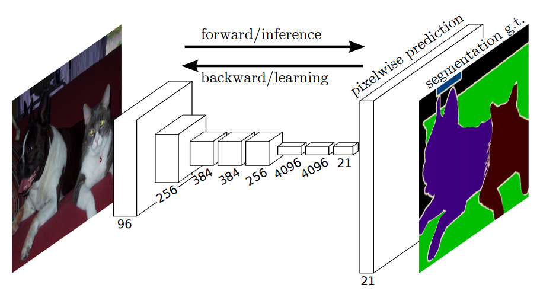
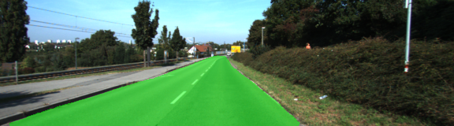
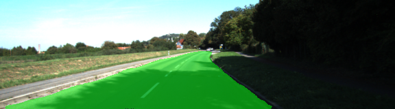
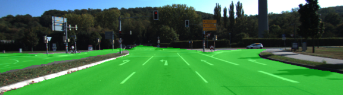
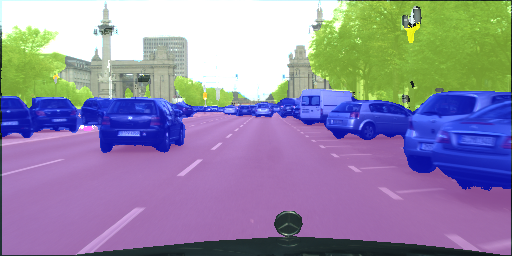
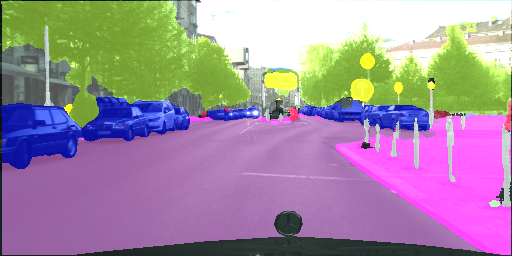
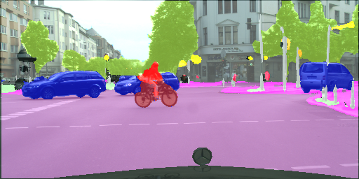

# Semantic Segmentation
### Introduction
In this project, you'll label the pixels of a road in images using a Fully Convolutional Network (FCN).

# Image-Segmentation

<p align="center">
   This is the general view of FCN Neural network architecture:  <br/>
   
</p>

Tensorflow impementation of Fully Convolutional Network (FCN) for  Image Segmentation Model 
(Paper : [Link](https://arxiv.org/pdf/1411.4038.pdf))


| CityScapeVideo 2-classes	|  CityScapeVideo 29-classes  |
|:-----------:|:----------:|
|[](https://www.youtube.com/watch?v=6R3j7DOauek)| [](https://www.youtube.com/watch?v=xwtslt9JOok)| 

## File hierarchy
Once you download pretrained model and dataset, please follow this project structure:

    ├── main.py               (Training FCN on Kitti Road dataset)
    ├── helper.py             (Helper preprocessing/postprocessing functions for Kitti Road dataset) 
    ├── project_tests.py      (Unit tests for main.py)
    ├── cityscapes_train.py   (Training FCN on Cityscapes  dataset)
    ├── cityscapes_helper.py  (Helper preprocessing/postprocessing functions for Cityscapes dataset) 
    ├── cityscapes_config.py  (Config file for training FCN on CItyscapes dataset)
    ├── cityscapes_predict.py (Perform image segmentation on custom image/video file)
    |── "runs"
    |   ├── kitti_output      (Examples of outputed files from trained model on kitti dataset)
    |   ├── cityscapes_output (Examples of outputed files from trained model on cityscapes dataset)
    ├── "data"                (Folder for dataset storage Kitti/Citiscapes according to the config)   
    |   ├── leftImg8bit_trainvaltest
    |     |      ├── sky-data
    |     |      |    ├── train       (train  gt labels)
    |     |      |    ├── val         (validation gt labels)
    |     |      |    ├── test         (test gt labels)
    |     |      |    
    |     |      ├── leftImg8bit
    |     |      |    ├── train       (train  input images)
    |     |      |    ├── val         (validation input images)
    |     |      |    ├── test         (test input images)

## Project Notes 
* First trained my model on Kitti dataset, achieved some results which were fair enough for passing this project
* Trained my model on 10 epocchs with 2 classes(road/car) on Citiscapes dataset, I got better results
* Trained my model on 60 epochs with 29 classes on Citiscapes dataset
    * Solved problem of exploding gradients with adding relu activations on all convolution layers
    * Added data augmentation 
        * Random shadow pieces 
        * Random brightness 
        * Added video/image processing script called `cityscapes_preddict` (see examples below)


## Support
**Prediction supports the following file formats : (Video : Mp4, Avi, Picture : PNG/JPEG)**

### Model prediction arguments

```
mandatory arguments:
  -media MEDIA_DIR, --media_dir MEDIA_DIR
                        Media Directorium for prediction (mp4,png)
optional arguments:
  -save SAVE_DIR, --save_dir SAVE_DIR
                        Save Directorium
  -model MODEL_DIR, --model_dir MODEL_DIR
                        Model Directorium
```

### Example semantic Image segmentation : 

```
python cityscapes_predict.py -media test_img.png
```

### Example semantic Video segmentation :
```
python cityscapes_predict.py -media test_video.mp4
```

## Output examples on test datasets
| Kitti Test Output1	|  Kitti Test Output 2   | Kitti Test Output 3|
|:-----------:|:----------:|:---------:|
| ||[| 

| CityScape test output1	| CityScape test output2    |CityScape test output3|
|:-----------:|:----------:|:---------:|
| ||[|


### Setup
##### GPU
`main.py` will check to make sure you are using GPU - if you don't have a GPU on your system, you can use AWS or another cloud computing platform.
##### Frameworks and Packages
Make sure you have the following is installed:
 - [Python 3](https://www.python.org/)
 - [TensorFlow](https://www.tensorflow.org/)
 - [NumPy](http://www.numpy.org/)
 - [SciPy](https://www.scipy.org/)

You may also need [Python Image Library (PIL)](https://pillow.readthedocs.io/) for SciPy's `imresize` function.

##### Dataset
Download the [Kitti Road dataset](http://www.cvlibs.net/datasets/kitti/eval_road.php) from [here](http://www.cvlibs.net/download.php?file=data_road.zip).  Extract the dataset in the `data` folder.  This will create the folder `data_road` with all the training a test images.

Download the [Cityscapes dataset](https://www.cityscapes-dataset.com/downloads/) from [here](https://www.cityscapes-dataset.com/downloads/). 
* Download gtFine_trainvaltest.zip (Annotated data)
* Extract the train/val/test datasets in the `data/leftImg8bit_trainvaltest/sky-data` folder. 
* Download leftImg8bit_trainvaltest.zip (Image data)
* Extract the train/val/test datasets in the `data/leftImg8bit_trainvaltest/leftImg8bit` folder. 

### Start
##### Implement
Implement the code in the `main.py` module indicated by the "TODO" comments.
The comments indicated with "OPTIONAL" tag are not required to complete.
##### Run
Run the following command to run the project:
```
python main.py
```
**Note:** If running this in Jupyter Notebook system messages, such as those regarding test status, may appear in the terminal rather than the notebook.

#### Example Outputs
Here are examples of a sufficient vs. insufficient output from a trained network:

Sufficient Result          |  Insufficient Result
:-------------------------:|:-------------------------:
  |  

### Submission
1. Ensure you've passed all the unit tests.
2. Ensure you pass all points on [the rubric](https://review.udacity.com/#!/rubrics/989/view).
3. Submit the following in a zip file.
 - `helper.py`
 - `main.py`
 - `project_tests.py`
 - Newest inference images from `runs` folder  (**all images from the most recent run**)
 
### Tips
- The link for the frozen `VGG16` model is hardcoded into `helper.py`.  The model can be found [here](https://s3-us-west-1.amazonaws.com/udacity-selfdrivingcar/vgg.zip).
- The model is not vanilla `VGG16`, but a fully convolutional version, which already contains the 1x1 convolutions to replace the fully connected layers. Please see this [post](https://s3-us-west-1.amazonaws.com/udacity-selfdrivingcar/forum_archive/Semantic_Segmentation_advice.pdf) for more information.  A summary of additional points, follow. 
- The original FCN-8s was trained in stages. The authors later uploaded a version that was trained all at once to their GitHub repo.  The version in the GitHub repo has one important difference: The outputs of pooling layers 3 and 4 are scaled before they are fed into the 1x1 convolutions.  As a result, some students have found that the model learns much better with the scaling layers included. The model may not converge substantially faster, but may reach a higher IoU and accuracy. 
- When adding l2-regularization, setting a regularizer in the arguments of the `tf.layers` is not enough. Regularization loss terms must be manually added to your loss function. otherwise regularization is not implemented.

### Why Layer 3, 4 and 7?
In `main.py`, you'll notice that layers 3, 4 and 7 of VGG16 are utilized in creating skip layers for a fully convolutional network. The reasons for this are contained in the paper [Fully Convolutional Networks for Semantic Segmentation](https://arxiv.org/pdf/1605.06211.pdf).

In section 4.3, and further under header "Skip Architectures for Segmentation" and Figure 3, they note these provided for 8x, 16x and 32x upsampling, respectively. Using each of these in their FCN-8s was the most effective architecture they found. 
